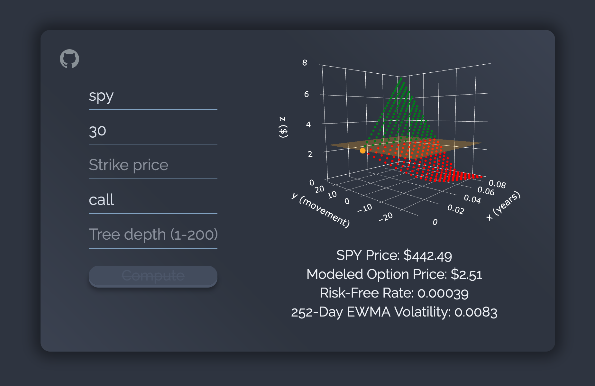

# [BOPM](https://feefs.me/bopm-cdk)
Computes and visualizes option prices in 3D using the binomial tree options pricing model.

Built with AWS CDK and [plotly.js](https://github.com/plotly/plotly.js)

    

